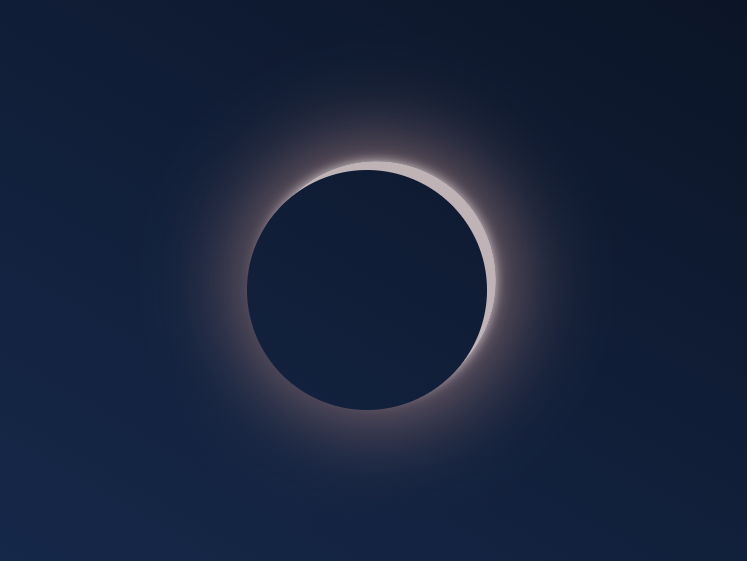

# 🌒 Solar Eclipse Animation

Una animación web interactiva y responsiva que simula un **Eclipse Solar** utilizando HTML5 y CSS3 puro (Keyframes, Pseudoelementos y Media Queries).


---

## 📌 Descripción

Este proyecto recrea visualmente la transición y el resplandor de un eclipse solar mediante técnicas avanzadas de CSS sin necesidad de bibliotecas externas ni JavaScript. 

Utiliza un pseudoelemento `::before` sobre un elemento base para animar la sombra, el cambio de posición (`translate`), el resplandor (`box-shadow`) y el brillo de la corona solar durante la alineación.

---

## ✨ Características

- 🎨 **Animación pura en CSS:** Hecha 100% con `@keyframes` y transformaciones 2D.
- 📱 **Diseño Responsive:** Adaptado para pantallas grandes y dispositivos móviles mediante `@media` queries.
- 🌌 **Efecto de Corona Solar:** Gradientes radiales y sombras múltiples (`box-shadow`) para simular la luz solar saliendo detrás de la luna.
- ⚡ **Ligero y Rápido:** Sin dependencias externas ni scripts pesados.

---

## 🚀 Vista Previa y Animación

La animación ejecuta una secuencia continua (`infinite alternate`) con los siguientes pasos clave:

1. **0% (Inicio):** La luna/sombra comienza desfasada arriba a la izquierda sin resplandor.
2. **50% (Eclipse Total):** La sombra se alinea perfectamente con el centro, generando el resplandor de la corona solar (`box-shadow`) y cambiando el color de fondo.
3. **100% (Final):** La sombra se desplaza hacia abajo a la derecha completando el tránsito.

---

## 🛠️ Tecnologías Utilizadas

- **HTML5:** Estructura semántica básica.
- **CSS3:**
  - `@keyframes` para la definición de los fotogramas de la animación.
  - Flexbox para el centrado del escenario.
  - Pseudoelemento `::before` para la capa del eclipse.
  - Media Queries (`max-width: 768px`) para adaptabilidad a móviles.

---

## 📂 Estructura del Proyecto

```text
Eclipse_Solar/
│
├── index.html    # Estructura principal
└── styles.css    # Estilos CSS y animaciones keyframe
```

---

<p align="center">
  
</p>
